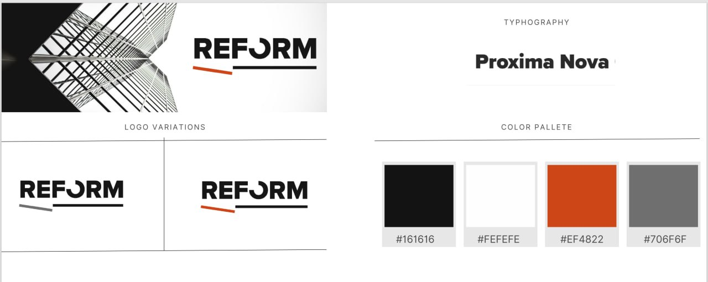

# REFORM - Architecture & Design



Современный веб-сайт архитектурной студии REFORM с потрясающими анимациями и многоязычной поддержкой.

## 🌟 Особенности

### ✨ Дизайн и UX
- **Премиум дизайн** - Apple-уровень эстетики с вниманием к деталям
- **Адаптивный дизайн** - Идеально работает на всех устройствах
- **Темная тема** - Элегантная темная цветовая схема
- **Градиентные эффекты** - Красивые переходы цветов
- **Стеклянный морфизм** - Современные полупрозрачные элементы

### 🎬 Анимации
- **Динамическая анимация печатания** - Циклическая смена брендовых фраз
- **Плавные переходы** - Микро-взаимодействия при наведении
- **Параллакс эффекты** - Интерактивный фон, реагирующий на курсор
- **Анимации появления** - Элементы появляются при прокрутке
- **Floating элементы** - Плавающие декоративные объекты

### 🌍 Многоязычность
- **Армянский (Հայերեն)** - Основной язык
- **Английский (English)** - Международная поддержка
- **Переключатель языков** - Удобный выбор языка в хедере
- **Полная локализация** - Все тексты переведены

### 📱 Технические особенности
- **React 18** с TypeScript
- **Tailwind CSS** для стилизации
- **Vite** для быстрой разработки
- **Lucide React** для иконок
- **Оптимизированная производительность**
- **SEO-дружественный код**

## 🚀 Быстрый старт

### Предварительные требования
- Node.js 18+ 
- npm или yarn

### Установка

```bash
# Клонировать репозиторий
git clone <repository-url>
cd reform-website

# Установить зависимости
npm install

# Запустить в режиме разработки
npm run dev

# Собрать для продакшена
npm run build

# Предварительный просмотр сборки
npm run preview
```

## 📁 Структура проекта

```
reform-website/
├── public/
│   └── 5233619750318371183.jpg    # Логотип REFORM
├── src/
│   ├── App.tsx                    # Основной компонент
│   ├── main.tsx                   # Точка входа
│   ├── index.css                  # Глобальные стили и анимации
│   └── vite-env.d.ts             # TypeScript декларации
├── index.html                     # HTML шаблон
├── package.json                   # Зависимости проекта
├── tailwind.config.js            # Конфигурация Tailwind
├── vite.config.ts                # Конфигурация Vite
└── README.md                     # Документация
```

## 🎨 Секции сайта

### 🏠 Главная (Hero)
- Динамическая анимация печатания с брендовыми фразами
- Интерактивный фон с эффектами
- Призывы к действию (CTA кнопки)

### 🛠️ Услуги (Services)
- 6 основных услуг с иконками и описаниями
- Hover эффекты и анимации
- Градиентные карточки

### 📊 Статистика (Stats)
- Ключевые показатели компании
- Анимированные числа
- Иконки достижений

### 🏗️ Проекты (Portfolio)
- Галерея выполненных проектов
- Категоризация по типам
- Hover эффекты с дополнительной информацией

### 📞 Контакты (Contact)
- Контактная информация с иконками
- Форма обратной связи
- Интерактивные элементы

## 🎭 Анимации

### Анимация печатания
Динамическая система смены фраз о бренде:

**Армянский:**
1. ՍՏԵՂԾՈՒՄ ԵՆՔ / ԱՊԱԳԱՅԻ / ՏԱՐԱԾՔՆԵՐ
2. REFORM / ՃԱՐՏԱՐԱՊԵՏՈՒԹՅՈՒՆ / & ԴԻԶԱՅՆ
3. ՆՈՐԱՐԱՐԱԿԱՆ / ԼՈՒԾՈՒՄՆԵՐ / ՁԵԶՆԻՑ ՀԱՄԱՐ
4. ՊՐԵՄԻՈՒՄ / ՈՐԱԿ / ԲԱՐՁՐ ՄԱԿԱՐԴԱԿ
5. ՍՏԵՂԾԱԳՈՐԾԱԿԱՆ / ՄՈՏԵՑՈՒՄ / ՅՈՒՐԱՔԱՆՉՅՈՒՐ ՆԱԽԱԳԾԻ

**Английский:**
1. CREATING / SPACES OF / THE FUTURE
2. REFORM / ARCHITECTURE / & DESIGN
3. INNOVATIVE / SOLUTIONS / FOR YOU
4. PREMIUM / QUALITY / HIGH STANDARD
5. CREATIVE / APPROACH / EVERY PROJECT

### CSS Анимации
- `fade-in-up` - Появление снизу вверх
- `float` - Плавающие элементы
- `glow` - Эффект свечения
- `gradient-shift` - Анимация градиента
- `typewriter-loop` - Циклическая печать

## 🌈 Цветовая палитра

```css
/* Основные градиенты */
Pink to Violet: from-pink-500 to-violet-600
Cyan to Blue: from-cyan-500 to-blue-500
Purple to Indigo: from-purple-900 via-blue-900 to-indigo-900

/* Акцентные цвета */
Pink: #ec4899
Violet: #8b5cf6
Cyan: #06b6d4
Blue: #3b82f6
```

## 📱 Адаптивность

- **Mobile First** подход
- Брейкпоинты: `sm:640px`, `md:768px`, `lg:1024px`, `xl:1280px`
- Адаптивная типографика
- Оптимизированные анимации для мобильных устройств

## ⚡ Производительность

- **Lazy Loading** изображений
- **Code Splitting** с Vite
- **Оптимизированные анимации** с `will-change`
- **Минимизированные ресурсы**
- **Сжатие изображений**

## 🔧 Настройка

### Изменение языков
Добавьте новый язык в `translations` объект в `App.tsx`:

```typescript
const translations = {
  // ... существующие языки
  ru: {
    home: 'Главная',
    services: 'Услуги',
    // ... другие переводы
  }
};
```

### Добавление новых анимаций
Создайте CSS анимацию в `index.css`:

```css
@keyframes your-animation {
  from { /* начальное состояние */ }
  to { /* конечное состояние */ }
}

.your-class {
  animation: your-animation 2s ease-in-out;
}
```

## 🚀 Деплой

Сайт автоматически деплоится на Netlify:

```bash
# Сборка проекта
npm run build

# Деплой (если настроен CI/CD)
git push origin main
```

## 📄 Лицензия

© 2024 REFORM. Все права защищены.

## 🤝 Вклад в проект

1. Форкните репозиторий
2. Создайте ветку для новой функции (`git checkout -b feature/amazing-feature`)
3. Зафиксируйте изменения (`git commit -m 'Add amazing feature'`)
4. Отправьте в ветку (`git push origin feature/amazing-feature`)
5. Откройте Pull Request

## 📞 Поддержка

Если у вас есть вопросы или предложения:
- Email: info@reform.am
- Телефон: +374 XX XXX XXX

---

**Создано с ❤️ для вдохновляющих архитектурных проектов**